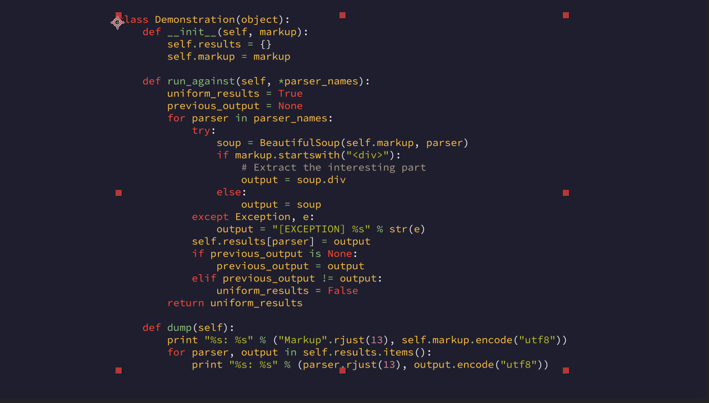

# AE Syntax Highlighter

Add syntax highlighting to After Effects text blocks.
Similar to [ASH](https://aescripts.com/ash-syntax-highlighter/) but written by me and distributed for free.

> [!NOTE]
> 
> I wrote this script back in early 2023 and didn't use it (prefer Motion Canvas for code animation)
> There will be no updates or patches

## Usage

Open "File > Scripts > Run Script File..." and select "code_highlighter.jsx":

Select language and color scheme:

Select text object and press apply:

Enjoy!